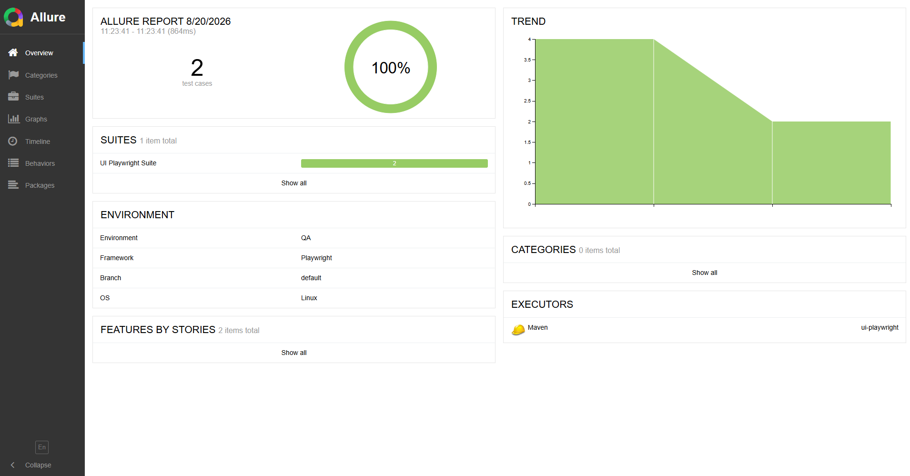

# Test Automation Bench Project

A comprehensive Java framework for test automation.

## 🎓 About This Project

This project serves as an **educational sketch and reference example** of how robust test automation can be implemented across multiple completely different software domains. It is built as a **Maven multi-module project** to demonstrate architectural best practices: isolating domain-specific dependencies while sharing common utilities.

At the heart of the framework is the `core` module, which contains shared logic (like configuration loading, data generation, and dependency injection). This core is inherited and utilized by independent domain-specific testing modules.

### Domains Covered:
*   **API Testing:** RESTful service validation with RestAssured library.
*   **Database (DB) Testing:** Direct JDBC integrations and SQL state validation.
*   **Mobile Testing:** Appium-based automation for Android and iOS devices.
*   **UI Testing (Dual Approach):** The web automation layer is deliberately split into two distinct paradigms to showcase different industry standards:
    *   **Classic Approach:** Utilizing `Selenide` (WebDriver-based) in the `ui` module.
    *   **Modern Approach:** Utilizing `Playwright` + `Cucumber` (BDD) in the `ui-playwright` module.

## 🛠️ Technology Stack

*   **Language:** Java 21
*   **Build Tool:** Maven (Multi-module POM packaging)
*   **Test Runner:** TestNG 7.11.0
*   **Dependency Injection:** Google Guice 7.0.0 for Dependency Injection
*   **BDD Framework:** Cucumber 7.27.0 (with Guice support)
*   **Reporting:** Allure 2.24.0 (with TestNG and Cucumber JVM integrations)
*   **JSON Processing:** Google Gson 2.14.0 (for serialization/deserialization)
*   **Execution Plugins:** `maven-surefire-plugin` (for unit/fast tests) and `maven-failsafe-plugin` (for integration tests)

## 📁 Multi-Module Architecture

The framework consists of the following modules:

1.  **`core`**: The foundational shared library. Must be built and installed before running any tests.
2.  **`api`**: REST API test automation.
3.  **`db`**: Database integration tests.
4.  **`mobile`**: Android/iOS Appium tests.
5.  **`ui`**: Browser UI tests via Selenide.
6.  **`ui-playwright`**: Browser UI tests via Playwright and Cucumber BDD.

## 🚀 How to Build and Run Tests

**Before running any tests, you must first build and install the core module artifact.**

1. Import as a Maven project in your IDE.
2. Navigate to the `core` module directory:

    ```sh
    cd core
    ```

3. Build and install the core artifact to your local Maven repository by running this command:

    ```sh
    mvn clean install
    ```

After this, you can navigate to the desired module (for example, `api`, `ui-playwright`, etc.) and execute the tests as described below.

### 1. Run Tests

    mvn clean test

---

### 2. Restore Allure History from Previous Runs (Optional — only if you want trend graphs)

Allure's **Trend** graphs (history of pass/fail counts, duration, retries across runs) are built by comparing the current run's results against a `history/` folder embedded in a *previous* report. That history is committed to the repo under each module's `allure-history/` directory (e.g., `mobile/allure-history/`), since `target/` is not persisted between clean builds.

Copy that saved history into this run's raw results directory (`target/allure-results/history`) so the *next* generated report can pick it up and draw trends:

    mvn antrun:run@restore-allure-history

---

### 3. Generate the Allure Report

    mvn allure:report

**Use `allure:report`, not `allure:serve`, at this step.** `allure:report` writes a persistent static site to `target/site/allure-maven-plugin/` (including a fresh `history/` folder derived from this run + whatever was restored in step 2). `allure:serve` instead builds the report into a temporary directory and serves it directly from there — it never writes anything under `target/site/allure-maven-plugin/`. Since the next step copies history *from* `target/site/allure-maven-plugin/history`, running `allure:serve` in place of `allure:report` here means that folder never exists, and `copy-allure-history` fails with an Ant `BuildException: ... history does not exist`.

---

### 4. Save Allure History for Future Runs (Optional — pairs with step 2)

Persist this run's freshly generated history back into the module's `allure-history/` folder so the trend chain continues on the next run:

    mvn antrun:run@copy-allure-history

Commit the updated `allure-history/*.json` files if you want the trend to survive across machines/CI runs.

---

### 5. (Optional) View the Report in Your Browser

Once the report has been generated (step 3), you can open it at any time:

    mvn allure:serve

`allure:serve` is purely for local viewing — it re-renders the already-generated results (plus whatever history is present in `target/allure-results/history`) into a temporary server and does not persist anything back to disk. Running it does not replace steps 3–4 if you care about preserving trends.

---

### Don't need history? Skip straight to viewing the report

If you don't care about trend graphs across runs (e.g., a one-off local run), you can skip steps 2–4 entirely and just run:

    mvn clean test
    mvn allure:serve

This opens a report immediately with results from just the current run, with no `Trend` graph (or a `Trend` graph frozen at a single data point).

---

## Notes

- **Allure Trends:**
  To keep test trends and history visible in Allure reports across runs, run the full restore → `allure:report` → save sequence (steps 2–4) — not `allure:serve`, which never touches `target/site/allure-maven-plugin/history`.

- **Database Tests:**  
  Before running tests in the `db` module, execute the script `init_test_db.sql` to create the database and tables.

- **UI Playwright Tests:**  
  Before running tests in the `ui-playwright` module, you must install Playwright browsers by running:

      mvn exec:java -e -D exec.mainClass=com.microsoft.playwright.CLI -D exec.args="install"

  To run Playwright tests that require GitHub authentication (such as tests that use a stored session for GitHub),  
  you must update your `env.conf` file with valid GitHub credentials.

  After running your tests, you may have a Playwright trace file (for example, `github-login-trace.zip`).  
  To view and analyze this traced session in your browser, run the following command:

      mvn exec:java -e -D exec.mainClass=com.microsoft.playwright.CLI -D exec.args="show-trace traces/github-login-trace.zip"

  This will open the Playwright Trace Viewer, allowing you to inspect every step of your test, including screenshots, network, console, and more.

- **Adjust Browser/Headless Mode:**  
  To change the default browser or headless mode for UI tests, pass JVM parameters when running tests. For example, this will run the UI tests in headed mode using Firefox instead of the default headless Chromium.:

      mvn clean test -Dheadless=false -Dbrowser=firefox

- **Mobile (Appium/Android/iOS) Tests:**  
  The `mobile` module drives a real Android device/emulator or iOS device/simulator via Appium and needs some one-time setup before running the tests will work:

    1. Install Node.js, then Appium and its drivers:

           npm install -g appium
           # For Android testing, UIAutomator2 driver is required:
           appium driver install uiautomator2
           # For iOS testing, XCUITest driver is required:
           appium driver install xcuitest

  2. Start an Android emulator/IOS Simulator or connect a physical device with USB debugging enabled:

       ```sh
       emulator -avd <your_avd_name>          # list AVDs with: emulator -list-avds
       ```

       *(Note: iOS testing requires a macOS machine and an active iOS Simulator via Xcode or connected IOS device).*

  3.  Confirm it's visible to ADB before running tests:

           adb devices

       You should see a line like `emulator-5554   device` (not `offline`/`unauthorized`).

  4. Ensure your device configuration matches a platform block in `env.conf` (e.g.,`android`, `ios`), where you configure `deviceName` and `platformVersion`.

  5. Run the test by specifying the target platform profile (via `-Dplatform`) and optional TestNG suite XML (via `-DintegrationSuiteXmlFile`):

      **For Android/IOS (Common suite):**

          mvn -f mobile/pom.xml clean verify -Dplatform=<android|ios>

      **For Android (Android Specific Suite):**

          mvn -f mobile/pom.xml clean verify -Dplatform=android -DintegrationSuiteXmlFile=android-smoke-suite

      **For iOS (iOS Specific Suite):**

          mvn -f mobile/pom.xml clean verify -Dplatform=ios -DintegrationSuiteXmlFile=ios-smoke-suite

**Why use `verify` instead of `test` for Mobile?**
The `mobile` module strictly separates fast architectural unit tests from heavy Appium UI integration tests using Maven's lifecycle phases:
* On the `test` phase, `maven-surefire-plugin` runs first to execute quick unit and architectural tests — specifically, validating that every declared page interface has its corresponding implementation for both Android and iOS.
* On the subsequent `integration-test` and `verify` phases, `maven-failsafe-plugin` takes over to run the heavy cross-platform Appium UI tests against real devices or emulators.

## ⚙️ Continuous Integration (CI/CD) & Reporting

This project is fully integrated with **GitHub Actions** to provide automated testing and reporting on every push and pull request to the `default` branch.

* **Automated Pipeline:** The CI pipeline automatically sets up JDK 17, installs project dependencies (including Playwright browsers), builds the `core` module, and runs the test suites (e.g., `ui-playwright`).
* **Allure Report Deployment:** After tests run, the pipeline automatically generates an Allure report. It dynamically restores previous test execution history to maintain test trend statistics, and finally deploys the generated interactive report directly to **GitHub Pages** for easy viewing.

### 📊 Hosted Reports

GitHub Pages is designed to host your personal, organization, or project pages directly from a GitHub repository.

After a successful CI run, your site goes live and the latest Allure report is accessible at your project's GitHub Pages URL:  
👉 **`https://<your-github-username>.github.io/<repository-name>/`**  
*(Example for this repository: [https://aliakseiboltak.github.io/bench-project/](https://aliakseiboltak.github.io/bench-project/))*

As shown in the screenshot below, the deployed report successfully parses and preserves the historical **Trend** data across runs, while also displaying the injected **Environment** details (such as the framework used, QA environment, OS, etc.):



## 🤖 AI Integration & Agents

This project is equipped with AI assistance instructions and specialized agents to help maintain, run, and scale the framework.

### 1. GitHub Copilot Instructions
The repository includes predefined instructions for GitHub Copilot. These guidelines ensure Copilot understands the custom multi-module Maven structure, Guice dependency injection patterns, TestNG standards, and Page Object Model implementations (across Selenide and Playwright). This context forces the AI to match existing conventions rather than introducing divergent patterns.

### 2. AI Agents
The project features three configured AI agents to help with code quality and architecture:
*   **`code-architect`**: A software architecture specialist responsible for design reviews, refactoring plans, and dependency analysis. It ensures modules remain loosely coupled, favors composition over inheritance, and plans breaking changes securely.
*   **`code-simplifier`**: A dedicated agent that reviews recently modified code to reduce complexity and redundancy. It streamlines logic and improves readability without altering external behavior or adding new dependencies.
*   **`staff-reviewer`**: A skeptical review agent that evaluates plans or architectural proposals *before* implementation. It pushes back on unnecessary complexity, highlights missing edge cases, and checks for security or performance concerns.

### 3. Claude Skills & Conventions
The repository contains specific configurations and operational rules for Anthropic's Claude:
*   **Skills (`skills/`)**: Contains executable workflows such as `run-tests` (smart execution of modules, handling required dependencies like `core` installation and test flags), `run-mobile-tests`, and `allure-report` (managing Allure histories and generating reports).
*   **Conventions (`conventions/`)**: Detailed architectural descriptions outlining module boundaries, Dependency Injection (Guice) rules, and test-writing standards. This ensures Claude maintains the strict stylistic and architectural consistency of the framework when helping with codebase modifications.

**Note:**  
For detailed info check README files in a particular module.